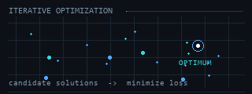

# Hi, I'm Wayan Raditya Putra

AI Engineering student at Institut Teknologi Sepuluh Nopember (ITS), interested in building practical intelligent systems and understanding how AI methods work beyond just using them.

---

## Current Focus

- Applied Machine Learning and AI systems
- NLP and Retrieval-Augmented Generation
- Optimization and intelligent algorithms
- End-to-end software engineering for AI applications

 

## Selected Work

- **[Biomedical NER with distant supervision](https://github.com/luminolous/BioNER-DS)** — contributed to PubMed data scraping and preprocessing for multi-entity NER experiments
- **[Student–tutor matching benchmark](https://github.com/WayanRadit29/match-triad-benchmark)** — CSP, Genetic Algorithm, and Simulated Annealing
- **[RAG-based startup knowledge assistant](https://github.com/WayanRadit29/tutaslearn-rag-startup-assistant)**
- **[Fuzzy emotional chatbot](https://github.com/WayanRadit29/fp-fis-ga-pso-emotional-chatbot)** — optimized with GA and PSO
- **[Tutas matching system](https://github.com/WayanRadit29/tutas-core)** — Hungarian and Louvain algorithms

 

## Tech

  
  
  
  
  
  
  
  

 

## Background

Previously built Tutas, a peer-to-peer academic support platform for students at ITS, combining product experimentation with matching and recommendation systems.
